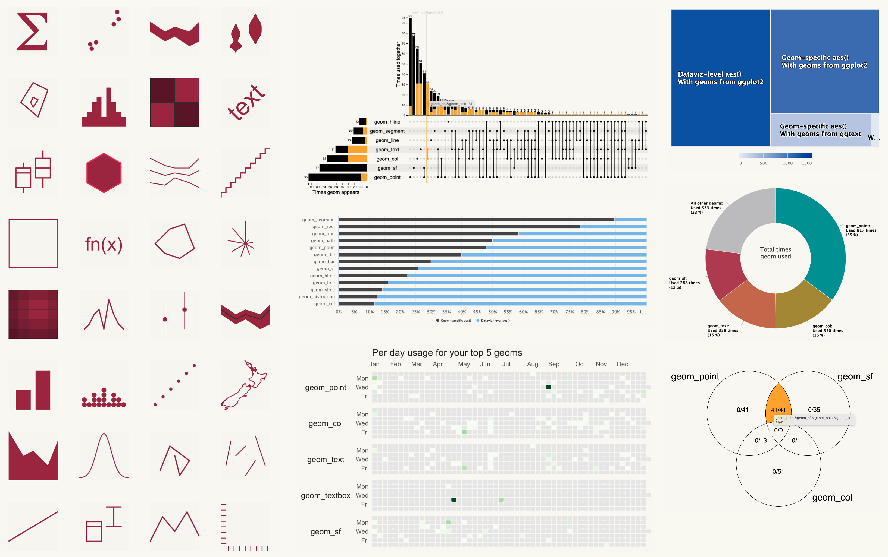

# ggplot2wrapped 

<!-- README.md is generated from README.Rmd. Please edit that file -->

```{r, include = FALSE}
knitr::opts_chunk$set(
  collapse = TRUE,
  comment = "#>",
  fig.path = "man/figures/README-",
  out.width = "100%"
)
```

# ggplot2wrapped

<!-- badges: start -->
<!-- badges: end -->

> Your year in {ggplot2}!

This package attempts to give you the Spotify Wrapped experience but looking at how you use the incredible {gglot2} package for visualising your data!

Within the package you will find 3 kinds of things:

- `ggplot_wrapped_2025()` for building your personalised interactive report on your year in {ggplot2}

- Functions for extracting your geom usage from across your whole code base.

- Individual visualisation functions used within the interactive report for exploring your geom usage

## Installation

This package is currently only available on GitHub and has a few dependencies to be aware of.

- You need to install `remotes::install_github("charliejhadley/GPCDStools")`

This should then work:

```{r, eval=FALSE}
remotes::install_github("visibledcharliejhadley/ggplot2wrapped")
```

If it doesn't you may have issues with a dependency {highcharter} which itself depends on {igraph}. 

If you are using R from homebrew that might be the reason as {igraph} doesn't like being built from source.

## Generating your own report

First you need to collect info about your code files. Modify the first argument to look at the locations you're interested in looking at.

> **There is example usage data in the `data_example_geom_usage` object if you prefer**

```{r, eval=FALSE}
library("ggplot2wrapped")
code_files <- get_code_file_info(c("~/Github/", "~/coding/r-projects-scrapbook/"), file_type = c(".qmd", ".R", ".Rmd"))

code_files
#> # A tibble: 2 × 4
#>   file_path          modified_time       created_time        access_time        
#>   <chr>              <dttm>              <dttm>              <dttm>             
#> 1 /Users/charliejha… 2022-04-20 20:10:12 2022-04-20 20:10:12 2025-11-21 14:28:18
#> 2 /Users/charliejha… 2022-04-20 20:10:14 2022-04-20 20:10:14 2025-11-21 14:06:55
```

Great! Now this package was thrown together in a week so makes a few assumptions and the report assumes you're looking at 2025 data - so let's filter that data.

```{r, eval=FALSE}
library("tidyverse")
target_year <- 2025
code_files_from_target_year <- code_files |>
  filter(year(modified_time) == target_year)
```

Now the clever function `add_geom_usage_to_files()` extracts your geom usage, if you have lots of files it might take a few minutes. [Which geoms do we look at?](#which-geoms-do-we-look-at)

> The output of this function contains **potentially sensitive information**!!
>
> Your actual geom calls are in the `function_call` argument so it might say geom_point(size = state_secrets).
>
> When you build the {ggplot2wrapped} nice report it will drop this argument - no sensitive information is included in the report.

```{r, eval=FALSE}
data_geoms_usage_target_year <- code_files_from_target_year |> 
  add_geom_usage_to_files()
#> # A tibble: 2 × 12
#>   file_path               file_extension modified_time       created_time       
#>   <chr>                   <chr>          <dttm>              <dttm>             
#> 1 /Users/charliejhadley/… R              2021-08-31 17:53:54 2022-04-07 19:50:42
#> 2 /Users/charliejhadley/… R              2021-08-31 17:53:54 2022-04-07 19:50:42
#> # ℹ 8 more variables: access_time <dttm>, geom_name <chr>, has_aes <lgl>,
#> #   function_call <list>, length_of_call <dbl>, n_args_in_call <dbl>,
#> #   n_times_used <int>, package_name <chr>
```

Neat! You're now ready to create your own report, it'll be saved into your project/working directory with the name `Charlie's ggplot2wrapped.html`

> **There is example usage data in the `data_example_geom_usage` object if you prefer**

```{r, eval=FALSE}
data_geoms_usage_target_year %>% 
  ggplot_wrapped_2025(data_geoms, report_year = target_year, exported_report_name = "Charlie's ggplot2wrapped.html")
```

Enjoy reading and please consider sharing your report with me (Charlotte Hadley) as I'd love to see it!

## Which geoms do we look at?

Ah. This package uses the {astgrepr} to work with the Abstract Syntax Trees of your code files. We need to be able to differentiate between these:

```{r, eval=FALSE}
# We want
ggplot() +
  geom_point()

# We don't want
g_title <- "I love geom_point"

# We don't want
geom_state_secret_custom <- function(){
  
}
```

We therefore explicitly **white list** geoms to be included in the analysis. Earlier there was a defaut argument used that we didn't mention:

```{r, eval=FALSE}
data_geoms_usage_target_year <- code_files_from_target_year |> 
  add_geom_usage_to_files(data_geoms = ggplot2wrapped::data_geoms)
```

The `data_geoms` dataset includes all geoms from {ggplot2}, {ggrepel} and {ggtext}. You're very welcome to provide a large white list, but note again that custom geom names and their arguments might be sensitive.

## What visualisations do I get?

We gave ourselves a week to write this package, the report and the visualisations within. There are currently 10 visualisations available.



Almost of these are available as functions within the package and can be used as below. Note that we'll be increasing the customisation of these functions after we release the 2025 wrapped report!

```{r, eval=FALSE}
data_example_geom_usage |> 
  make_geom_interactive_upset_chart(height = 600)
```

